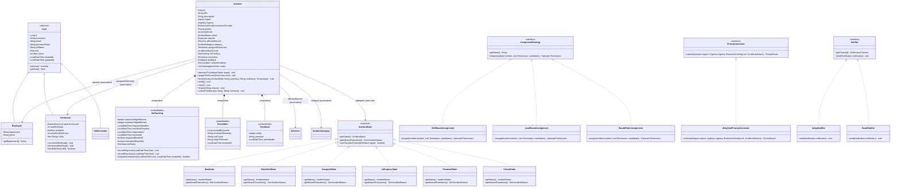

# Resolvo UML Class Diagram

> **Architecture**: Clean Object-Oriented Domain Model
> **Patterns Represented**: State, Strategy, Observer, Factory, Adapter, Repository

```mermaid
classDiagram
    %% Core User Hierarchy (Inheritance & Polymorphism)
    class User {
        <<abstract>>
        -Long id
        -String username
        -String email
        -String passwordHash
        -String fullName
        -Role role
        -boolean active
        -LocalDateTime createdAt
        -LocalDateTime updatedAt
        +isActive() boolean
        +getRole() Role
    }

    class Employee {
        -String department
        -String phone
        +getDepartment() String
    }

    class Technician {
        -ExperienceLevel experienceLevel
        -int maxWorkload
        -boolean available
        -int activeIncidentCount
        -Set~String~ skills
        +incrementWorkload() void
        +decrementWorkload() void
        +hasSkill(String skill) boolean
    }

    class Administrator {
    }

    User <|-- Employee
    User <|-- Technician
    User <|-- Administrator

    %% Incident Aggregate Root & Value Objects (Composition & Association)
    class Incident {
        -Long id
        -String title
        -String description
        -Impact impact
        -Urgency urgency
        -BusinessCriticality businessCriticality
        -Priority priority
        -int priorityScore
        -IncidentStatus status
        -Employee reporter
        -ItService affectedService
        -IncidentCategory category
        -Technician assignedTechnician
        -int affectedUserCount
        -SlaTracking slaTracking
        -Resolution resolution
        -Feedback feedback
        -Set~Incident~ relatedIncidents
        -List~InvestigationNote~ notes
        +transitionTo(IncidentStatus target) void
        +assignTechnician(Technician tech) void
        +resolve(Long resolvedById, String summary, String rootCause, String steps) void
        +verify() void
        +close() void
        +reopen(String reason) void
        +submitFeedback(int rating, String comment) void
    }

    class SlaTracking {
        <<embeddable>>
        -Integer responseTargetMinutes
        -Integer resolutionTargetMinutes
        -LocalDateTime responseDeadline
        -LocalDateTime resolutionDeadline
        -LocalDateTime respondedAt
        -LocalDateTime resolvedAt
        -boolean responseBreached
        -boolean resolutionBreached
        -SlaStatus slaStatus
        +recordResponse(LocalDateTime time) void
        +recordResolution(LocalDateTime time) void
        +evaluateCompliance(LocalDateTime now, LocalDateTime createdAt) boolean
    }

    class Resolution {
        <<embeddable>>
        -Long resolvedByUserId
        -String resolutionSummary
        -String rootCause
        -String stepsToResolve
        -LocalDateTime resolvedAt
    }

    class Feedback {
        <<embeddable>>
        -Integer rating
        -String comment
        -LocalDateTime submittedAt
    }

    Incident *-- SlaTracking : composition
    Incident *-- Resolution : composition
    Incident *-- Feedback : composition
    Incident --> Employee : reporter (association)
    Incident --> Technician : assignedTechnician (association)
    Incident --> ItService : affectedService (association)
    Incident --> IncidentCategory : category (association)

    %% State Pattern Hierarchy
    class IncidentState {
        <<interface>>
        +getStatus() IncidentStatus
        +getAllowedTransitions() Set~IncidentStatus~
        +canTransitionTo(IncidentStatus target) boolean
    }

    class NewState {
        +getStatus() IncidentStatus
        +getAllowedTransitions() Set~IncidentStatus~
    }
    class ClassifiedState {
        +getStatus() IncidentStatus
        +getAllowedTransitions() Set~IncidentStatus~
    }
    class AssignedState {
        +getStatus() IncidentStatus
        +getAllowedTransitions() Set~IncidentStatus~
    }
    class InProgressState {
        +getStatus() IncidentStatus
        +getAllowedTransitions() Set~IncidentStatus~
    }
    class ResolvedState {
        +getStatus() IncidentStatus
        +getAllowedTransitions() Set~IncidentStatus~
    }
    class ClosedState {
        +getStatus() IncidentStatus
        +getAllowedTransitions() Set~IncidentStatus~
    }

    IncidentState <|.. NewState
    IncidentState <|.. ClassifiedState
    IncidentState <|.. AssignedState
    IncidentState <|.. InProgressState
    IncidentState <|.. ResolvedState
    IncidentState <|.. ClosedState
    Incident --> IncidentState : delegates state rules

    %% Strategy Pattern Hierarchy
    class AssignmentStrategy {
        <<interface>>
        +getName() String
        +assign(Incident incident, List~Technician~ candidates) Optional~Technician~
    }

    class SkillBasedAssignment {
        +assign(Incident incident, List~Technician~ candidates) Optional~Technician~
    }
    class LoadBasedAssignment {
        +assign(Incident incident, List~Technician~ candidates) Optional~Technician~
    }
    class RoundRobinAssignment {
        +assign(Incident incident, List~Technician~ candidates) Optional~Technician~
    }

    AssignmentStrategy <|.. SkillBasedAssignment
    AssignmentStrategy <|.. LoadBasedAssignment
    AssignmentStrategy <|.. RoundRobinAssignment

    class PriorityCalculator {
        <<interface>>
        +calculate(Impact impact, Urgency urgency, BusinessCriticality crit, int affectedUsers) PriorityResult
    }
    class WeightedPriorityCalculator {
        +calculate(Impact impact, Urgency urgency, BusinessCriticality crit, int affectedUsers) PriorityResult
    }
    PriorityCalculator <|.. WeightedPriorityCalculator

    %% Adapter Pattern (Notification Channels)
    class Notifier {
        <<interface>>
        +getChannel() NotificationChannel
        +send(Notification notification) void
    }
    class InAppNotifier {
        +send(Notification notification) void
    }
    class EmailNotifier {
        +send(Notification notification) void
    }
    Notifier <|.. InAppNotifier
    Notifier <|.. EmailNotifier
```
